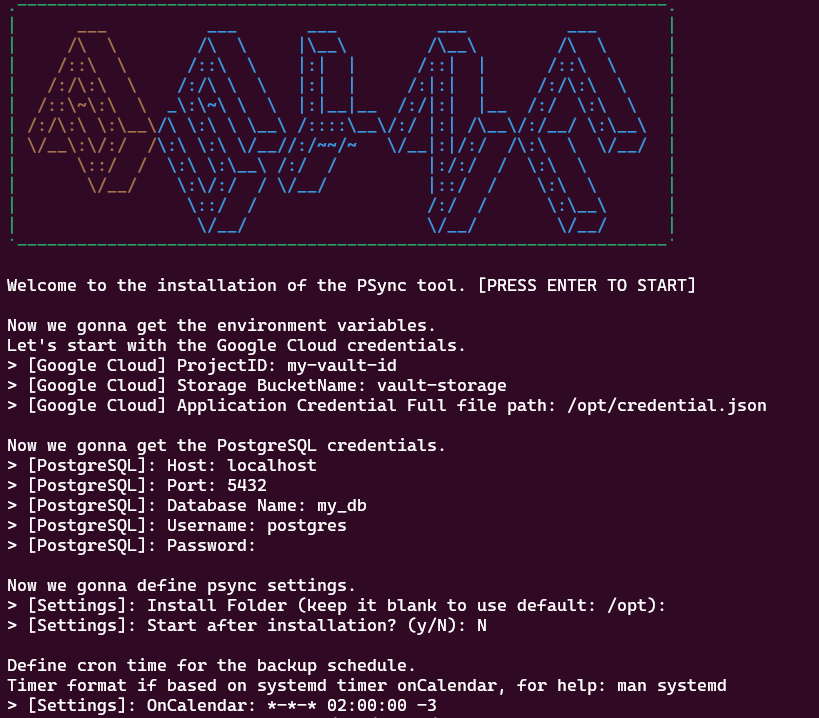

<!-- markdownlint-configure-file {
  "MD013": {
    "code_blocks": false,
    "tables": false
  },
  "MD033": false,
  "MD041": false
} -->

psync is a **easy postgres backup**, using Google Cloud Storage as vault.

It remembers which directories you use most frequently, so you can "jump" to
them in just a few keystrokes.

[Getting started](#getting-started) •
[Installation](#installation) •
[Usage](#usage)

---
## Getting started

## Installation
